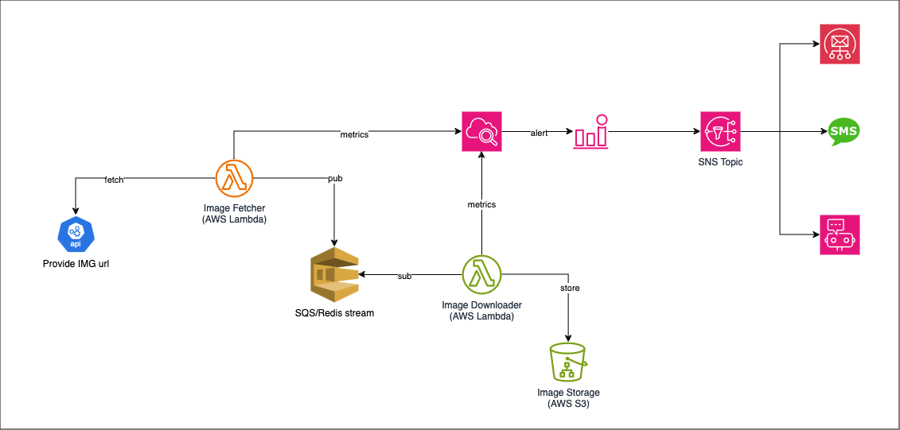

# Go Lang Script For Dump 50 Million Images

## Requirement

I'm seeking a skilled Go Lang developer to create a script for downloading 50 million PNG files (around 500KB each). The source of these files will be an API. The challenge lies in the time constraint - all files need to be downloaded within 72 hours of starting the script. This translates to an average of 190 files per second.

Key Project Components:

- Efficiently downloading files using AWS Lambda to manage high call volumes.
- Storing each downloaded file in AWS S3.
- Implementing immediate retry logic for failed downloads.

To keep track of the script's performance, I will be using AWS CloudWatch. Ideally, you have experience with this tool and can integrate it into the script for real-time monitoring.

Your skills should include:

- Proficiency in Go Lang, with a portfolio of similar projects.
- Extensive experience with AWS services, particularly Lambda and S3.
- Familiarity with API interaction and handling large-scale data downloads.
- Knowledge of AWS CloudWatch for performance tracking.

<u>Noted</u>: The script should only run in 2 or 3 days.

## Technology

- AWS Services.
- Source image get from API third-party (unknowns).

## System architecture



## How to run

1. Run start docker localstack with AWS services.

```cmd
docker compose up -d
```

2. Show & create new bucket S3 with command.

- Create new a bucket name:

```cmd
docker compose exec -ti aws bash -c "awslocal s3api create-bucket --bucket ${BUCKET_NAME}"
```

- Show list bucket S3 on system AWS.

```cmd
docker compose exec -ti aws bash -c "awslocal s3api list-buckets"
```

3. Show logs with cloudwatch
